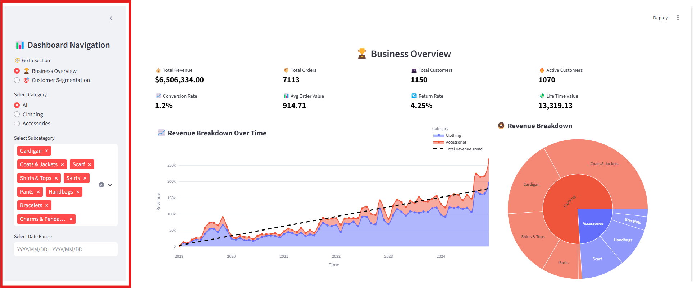
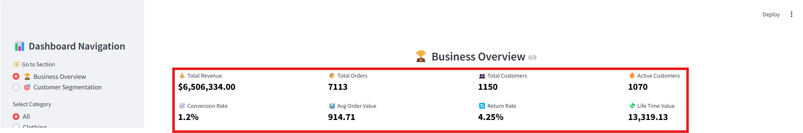
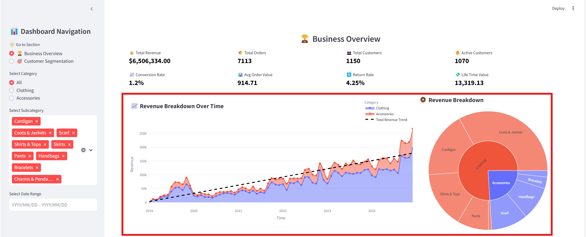
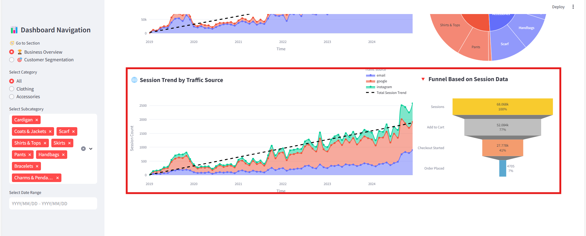
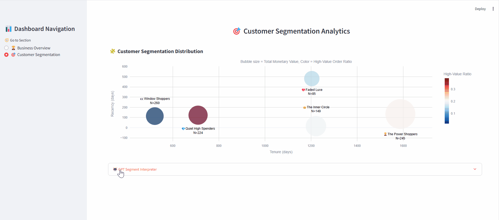

&#x20;

# Shopify Business Analytics Dashboard

> A **Streamlit** application that provides a full-stack analytics for LuxCouture - a Shopify-style E-commerce platform. Built with **Python** and **Streamlit**, it transforms retail and Shopify data into clear and efficient visualization dashboards,  empowering small businesses to optimize marketing strategies and boost popularity and sales.

---

## 🔑 Key Features
> **Interactive Charts**: Hover for detailed deltas and explore daily or weekly performance shifts.

### 🏆 Business Overview
- **Dynamic Sidebar Navigation**: Section selection; Category, subcategory & date Range filter application
   

      
   

- **Comprehensive KPIs**  
   - Total Revenue, Order Count, Active vs. Total Customers  
   - Conversion Rate, Return Rate, AOV & LTV
   

      
   
  

- **Sales Analysis**: Revenue breakdown by category with regression-based trend line; subcategory revenue pie chart
   

      
   
  
   
- **Session Trend Analysis**: Online session breakdown by traffic source with linear-regression trend line; online session conversion funnel
   

      
   
 

### 🎯 Customer Segmentation
- **Cluster Exploration**: Behavioral clustering and bubble plot based on recency, CLV, high-value ratio, etc.
  

      
   
   
- **AI‑Driven Insights**: GPT-powered assistant suggesting email + social campaigns tailored to seasonal context and segment charateristics via **gpt-3.5-turbo**
    
---

## 📄 License

Licensed under the **MIT License**. See [LICENSE](./LICENSE) for details.

